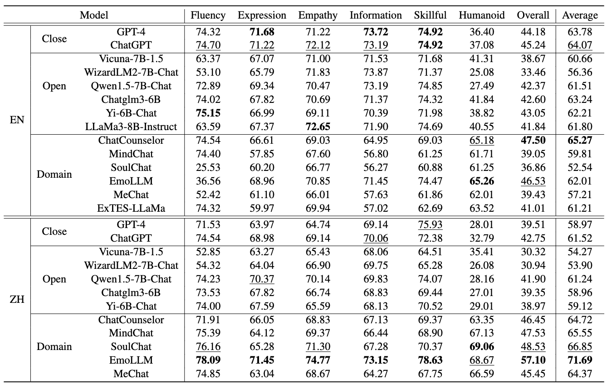

# ESC-Eval
**Paper link:** https://arxiv.org/abs/2406.14952

This is the official repository of ESC-Eval, which includes the datasets and models used in the [ESC-Eval](https://arxiv.org/abs/2406.14952) paper. The paper proposes a method for evaluating ESC models using a role-playing model, and the specific process is illustrated in the following Figure.

### TODO
- [ ] Middle quality character card upload
- [ ] update score.py 

## Overview
- ./data: role_cards data use in the paper
- ./ESC-Role: our trained role playing agents which performace better than GPT4 in role-palying of a trouble person.
- ./ESC-RANK: our trained scorer for scoring dialogues data according to 7 well-designed dimensions.
- ./result: some examples of multi-turn conversations.
- ./evaluate.py: get the multi-round dialogue script of the ESC model.
<!-- - ./ESC-Role:  -->

## Usage
1. Download [ESC-Role](https://huggingface.co/haidequanbu/ESC-Role) and replace the folder of './ESC-Role'
2. Change your LLM-based ESC-model to the format of below (we also list examples of llama3 and Qwen1.5 in evaluate.py) :
<html>
    <head>

        class YourModel():
            def __init__(self):
                self.tokenizer = AutoTokenizer.from_pretrained("model_dir")
                self.model = AutoModelForCausalLM.from_pretrained("model_dir",torch_dtype="auto",device_map="auto").eval()
            def __call__(self, message) -> str:
                reponse=self.model.chat(message)
                return response

</head>
</html>

3. run evaluate.py to get multi-turn dialogue data, examples:
<html>

    python evaluate.py -ef ./data/test_zh.json -rf ./result/ -lang zh 
    python evaluate.py -ef ./data/test_en.json -rf ./result/ -lang en

</html>
After this progress, you should get some json data in the format of examples list in folder ./result.

4. Download [ESC-RANK](https://huggingface.co/haidequanbu/ESC-RANK) to folder ESC-RANK
5. run score.py using ESC-RANK on your interactive data.

## User Cards

**Statics**

## ESC-Role
ESC-Role is a specific role-playing models for ESC evaluation, which could be download form : https://huggingface.co/haidequanbu/ESC-Role

## ESC-RANK
ESC-RANK is our training scoring for ESC evaluation, which could be download form : 
https://huggingface.co/haidequanbu/ESC-RANK

**Scoring performace**

## Leaderboard
**Human Evaluation**

## Cite
Our paper is coming soon.